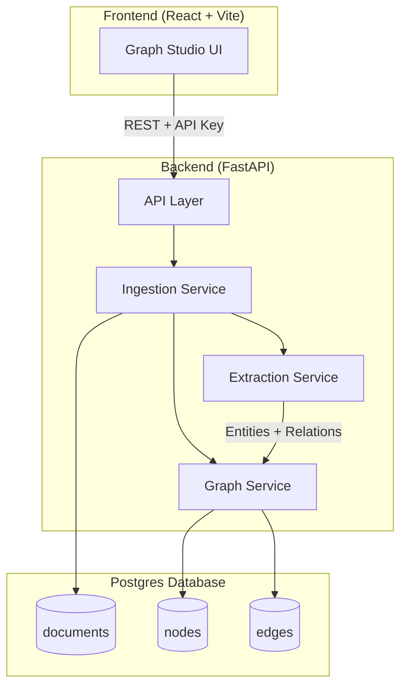

# Graph-Enhanced RAG

A knowledge-graph-first RAG system that ingests unstructured text or URLs, extracts entities and relations with an LLM, stores them in Postgres, and answers multi-hop questions via recursive SQL traversal.

## What You Get

- Entity + relation extraction using LangChain + OpenAI
- Graph storage in Postgres (nodes + edges + documents)
- Recursive CTE traversal for impact analysis and path finding
- Dedicated frontend and backend services for clean deployment on Railway

## Resume-Ready Highlights

- Built a graph-first RAG engine with recursive SQL traversal for explainable multi-hop reasoning.
- Added multi-path scoring with human-readable path explanations to make traversal decisions auditable.
- Implemented data quality controls: deterministic normalization, alias tracking, and optional LLM canonicalization.
- Hardened the service with rate limits, payload guards, retries, and structured JSON logging.
- Shipped an interactive demo studio UI with demo-mode seeding for fast product walkthroughs.

## Repo Layout

```
graph-enhanced-rag/
├── backend/
│   ├── app/                 # FastAPI app package
│   │   ├── api/
│   │   ├── models/
│   │   ├── services/
│   │   └── utils/
│   ├── evals/               # Labeled evaluation dataset
│   ├── scripts/             # Evaluation scripts
│   ├── tests/               # Pytest suite
│   ├── requirements.txt
│   ├── pyproject.toml
│   ├── railway.json         # Backend Railway config
│   ├── nixpacks.toml
│   ├── Procfile
│   └── .env.example
└── frontend/
    ├── src/                 # React + Vite app
    │   ├── components/
    │   ├── data/
    │   └── services/
    ├── package.json
    ├── railway.json         # Frontend Railway config
    └── .env.example
```

## Architecture



## Backend Overview

Key modules:

- `backend/app/services/extraction.py` – LLM extraction
- `backend/app/services/ingestion.py` – ingest pipeline
- `backend/app/services/graph.py` – recursive CTE traversal
- `backend/app/api/ingest.py` – ingestion endpoints
- `backend/app/api/graph.py` – graph CRUD + queries

Core endpoints:

- `POST /ingest/text`
- `POST /ingest/url`
- `GET /graph/nodes`
- `GET /graph/edges`
- `POST /graph/query/impact`
- `POST /graph/query/path`
- `GET /health`

### Data Quality Controls

- Deterministic normalization for entity types and relation verbs (e.g., `db` → `database`, `connects` → `connects_to`).
- Alias tracking for entity names to reduce duplicates.
- Optional LLM-assisted canonicalization for higher-quality labels (`ENABLE_LLM_CANONICALIZATION=true`).

### Production Features

- Structured JSON logging (configurable via `LOG_LEVEL`).
- In-memory rate limiting per client+API key (`RATE_LIMIT_*`).
- Request size guard (`MAX_REQUEST_SIZE_BYTES`).
- Retry logic for upstream network calls.

### Explainable Path Queries

`POST /graph/query/path` now returns multiple scored paths with a short explanation string
for each path, making traversal decisions inspectable.

Example response:

```json
{
  "source_node": "Service A",
  "target_node": "Database B",
  "paths": [
    {
      "path": [
        { "id": 1, "name": "Service A", "type": "service" },
        { "id": 2, "name": "Database B", "type": "database" }
      ],
      "relations": ["depends_on"],
      "path_length": 1,
      "score": 1.0,
      "explanation": "Service A -[depends_on]-> Database B"
    }
  ],
  "total_paths": 1,
  "found": true
}
```

## Frontend Overview

The frontend provides a studio-style UI for:

- Text or URL ingestion
- Graph visualization
- Impact analysis
- Demo mode with a sample dataset

Configure the API connection via `VITE_API_BASE_URL`.

## Local Development

### Backend

```
cd backend
python -m venv venv
source venv/bin/activate
pip install -r requirements.txt
cp .env.example .env
uvicorn app.main:app --reload
```

### Frontend

```
cd frontend
npm install
cp .env.example .env
npm run dev
```

## Railway Deployment (Two Services)

Create two Railway services from the same repo.

### Backend Service

- Root directory: `backend`
- Environment variables:
  - `DATABASE_URL`
  - `OPENAI_API_KEY`
  - `API_KEY`
  - `CORS_ALLOW_ORIGINS` (set to your frontend URL)
- Start command is defined in `backend/railway.json`

### Frontend Service

- Root directory: `frontend`
- Environment variables:
  - `VITE_API_BASE_URL` = backend service URL
  - `VITE_API_KEY` = same API key as backend
- Start command is defined in `frontend/railway.json`

## Example Request

```
curl -X POST "https://your-backend.railway.app/ingest/text" \
  -H "X-API-Key: your-api-key" \
  -H "Content-Type: application/json" \
  -d '{
    "text": "Server A depends on Database B. Database B connects to Cache C. The Payment Service uses Server A.",
    "metadata": {"source": "architecture-doc"}
  }'
```

## License

MIT License. See `LICENSE`.
